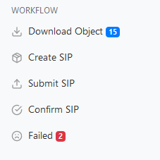
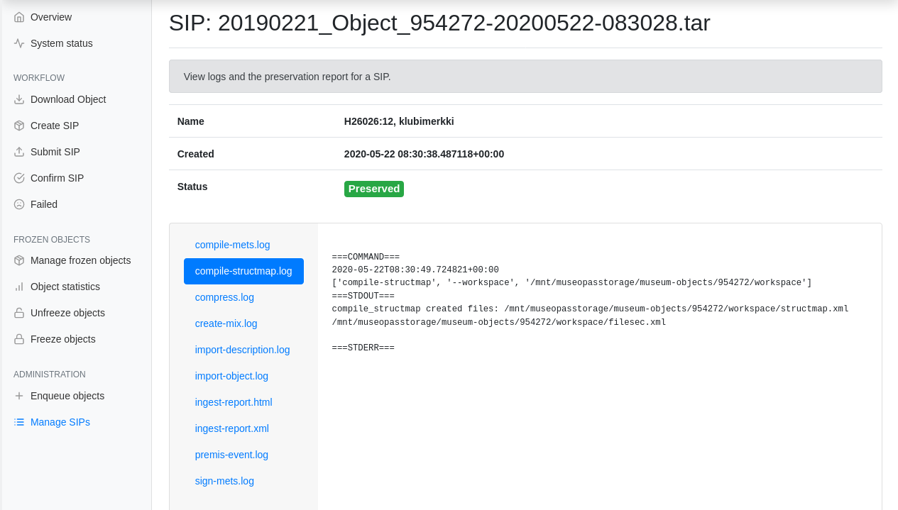
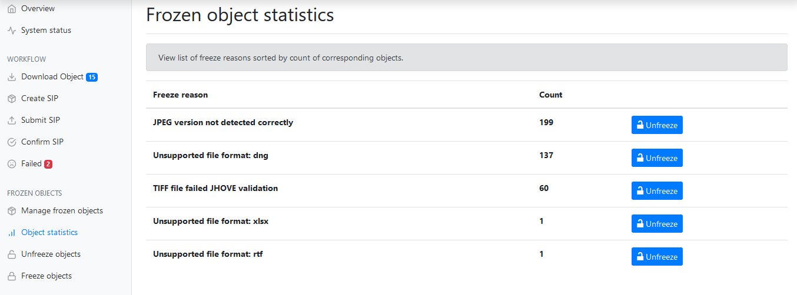

Usage
=====

Preserving objects
------------------

Once the workflow is properly configured and it has started synchronizing objects, you can enqueue objects to the workflow using the **Enqueue objects** page.

.. note::

   You should start by enqueueing smaller amounts of objects at a time (eg. 500 objects at a time).

   This allows you to determine how fast objects can be downloaded from MuseumPlus and how fast they can submitted to the DPRES service, as well as how many objects may fail packaging for various reasons and may require inspection.

Once enqueued, you can follow the objects' progress through the workflow in the **Download Object**, **Create SIP**, **Submit SIP**, **Confirm SIP** and **Failed** tabs.

   Sidebar displaying the workflow status. 15 objects are pending in the **Download Object** queue and 2 objects have failed in the workflow and are awaiting user action.

In the successful scenario, the object is downloaded, packaged and submitted to the DPRES service successfully. In this case, you can find the SIP details, including the workflow logs and the preservation report (`ingest-report.html`) in the *Manage SIPs* tab.

   Inspecting workflow logs for a SIP that was accepted into preservation.

Managing failed SIPs
--------------------

The workflow for an object may fail for multiple reasons: one of the attachments may fail validation, or the MuseumPlus instance might be temporarily down, causing the **Download Object** task to fail.

You can inspect the failed objects in the **Failed** tab.

Requeue the object
^^^^^^^^^^^^^^^^^^

If the object failed due to a transient error (eg. network issue), you can press **Requeue** for that object to requeue it. The workflow process will continue from the last step.

A common transient error is a network timeout caused by the MuseumPlus service.

.. tip::

   If many objects have failed due to a single transient error (eg. MuseumPlus was down for maintenance at the time), you can simply press **Requeue All**.

   Requeuing is safe -- objects that failed due to a non-transient error will reappear in the **Failed** page shortly with the same error message, making it a good option for cleaning the queue and reducing the queue to a list of objects that have a repeatable error.

Examine object failure
^^^^^^^^^^^^^^^^^^^^^^

If the object failed in the **Create SIP** queue, the most common reason is that the object didn't pass validation for some reason and the error wasn't automatically recognized by *Passari*.

In this case, you'll usually have to inspect the logs for the SIP to determine the exact reason for failure. Click **View SIP** and inspect the log files.

.. tip::

   For objects that failed validation, you can usually find the reason for failure by inspecting the last command that was executed in the ``import-object.log`` log file.

In case of failed validation, one of the files might be invalid (usually the case if the error is raised by *JHOVE*) or that the file format or version isn't supported (yet) by the `dpres-siptools <https://github.com/Digital-Preservation-Finland/dpres-siptools>`_ validation tools. You can contact DPRES support with a copy of the file that's failing validation as well as the error created by the validator.

.. tip::

   If the same error happens frequently, you can modify *Passari* to automatically the freeze object. Check the documentation for *Passari* for details.

Freeze the object
^^^^^^^^^^^^^^^^^

If the error causing the object to fail in the workflow cannot be fixed immediately, it's best to freeze the object so that the object -- as well as other objects with the same fault -- can be easily unfrozen and added back into preservation with a single action once the problem is fixed.

Freezing the object prevents the object from re-entering the workflow until the object is unfrozen.

Unfreezing objects
------------------

Objects that have been frozen -- either manually or automatically by *Passari* -- can be unfrozen either individually or by unfreezing all objects with the same reason. This can be done in either **Manage frozen objects**, **Object statistics** or **Unfreeze objects**.

This can be done after the problem preventing the objects from being preserved is solved.

   **Frozen object statistics** page can be used to view and unfreeze multiple objects based on rate of occurrence
